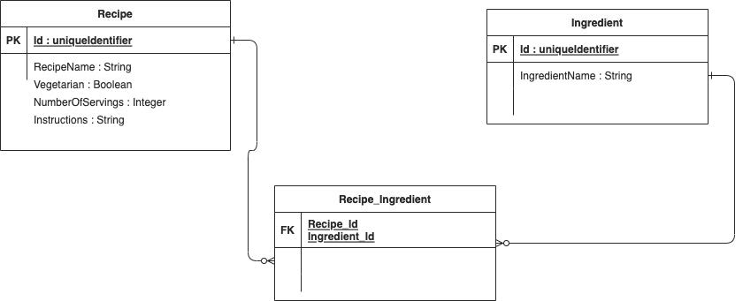

## Java

### Backend-Recipes
[Spring Boot](https://spring.io/projects/spring-boot/) application contains the Backend (apis) for the customer and business User. This project is a plan project to create Rest API's.

- Example of Rest Api's developed using Spring and spring boot.
- It will allow the users to add, update, delete and get recipes and ingredients. 
- In memory database H2 is used.
- JPAmodelgen dependency is used to retrieve the values.
- Specifications are used to create the criteria.
- Test cases are added using Junit.
- github CI pipeline added.

### Dependencies
There are a number of dependencies used in the project. Browse the Maven pom.xml file for details of libraries and versions used.

### Project Setup
- Install [Java 8](https://www.oracle.com/technetwork/java/javase/downloads/jdk8-downloads-2133151.html)

- Install [Maven](https://maven.apache.org/install.html)

### Use below command to run the Backend service
```
mvn spring-boot:run
```
- Application will be up on localhost port 8080 and can be tested using swagger. http://localhost:8080/swagger-ui.html.
- Endpoints GET, DELETE, POST under ingredients-controller should be used for adding ingredients first.
- Endpoints GET, DELETE, POST, PUT under recipes-controller can be used for recipes. 
- H2 database can be accessed using http://localhost:8080/h2-console

### Use below command to run the Test cases
```
mvn clean test
```


### UML Diagram




